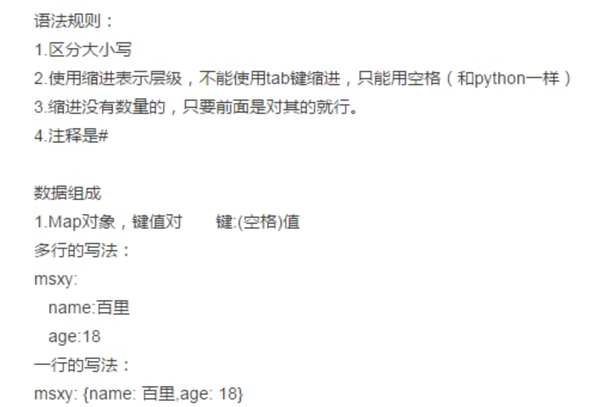

# pytest
##  一、@pytest.fixture   
    用于前后置方法的调用(日志、浏览器、接口等初始化工作，参见test_fixture.py)
1. parameters
   * scope:作用域控制（function,class，module等）
   * autouse:自动执行，若为true此所选作用域下都生效，不用在单独配置
   * params:支持（列表，元组，字典，字典元组）
   * name：函数别名，当使用别名后，原函数名不能使用
2. 通过conftest.py和pytest.fixture()结合使用实现全局（如：项目的全局登录，模块的全局处理）
   * conftest.py是单独存放的一个配置文件，名称不能修改
   * 在不同的py文件中使用相同的配置文件
   * 原则上要和被执行的文件在同一层，不需要import导入，放到根目录后为全局控制
3. 总结：
   * setup/tearsdown setpu_class/tearsdown_class 它是作用所有用例或是所有的类
   * @pytest.fixture 提供或全部或是部分的前后置关系
   * conftest.py 和fixture 结合 使用，作用于全局的前后置
## 二、断言：
* ~~~
  assert 1==2 

## 三、@pytest.mark.parametrize(args_name, args_value)
### 1. parameters:
   * args_name:参数名
   * args_value: 参数值：列表、元组、字典列表、字典元组
   * ~~~
      class Test_Api:
      @pytest.mark.smoke
      @pytest.mark.parametrize('args', ['test0', 'test1', 'test2'])
      def test_api(self, args):
         print("\nTesting")
         print(args)
## 四、yaml文件详解:   
 参见yaml_util.py

## 五、yaml实战：

